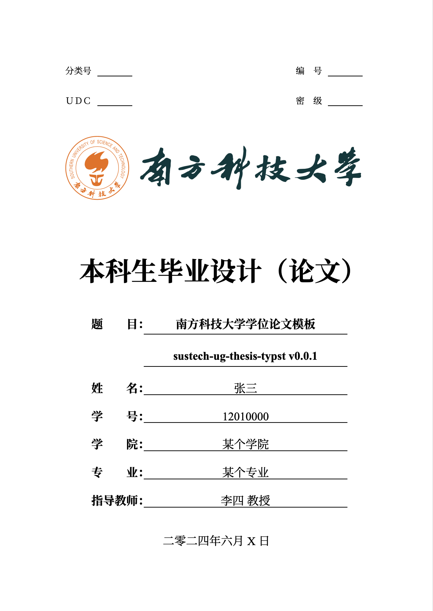

# Typst Template for Undergraduate Thesis of SUSTech.

Do not use at the moment! Still under heavy development.

The full PDF file is available [here](./resources/sample.pdf).

## Usage

- Install the latest version of [Typst](https://github.com/typst/typst)
- Download and extract the entire folder
- Modify `metadata.typ` and `thesis.typ`
- Run `typst compile thesis.typ --font-path resources/fonts` to compile the thesis
